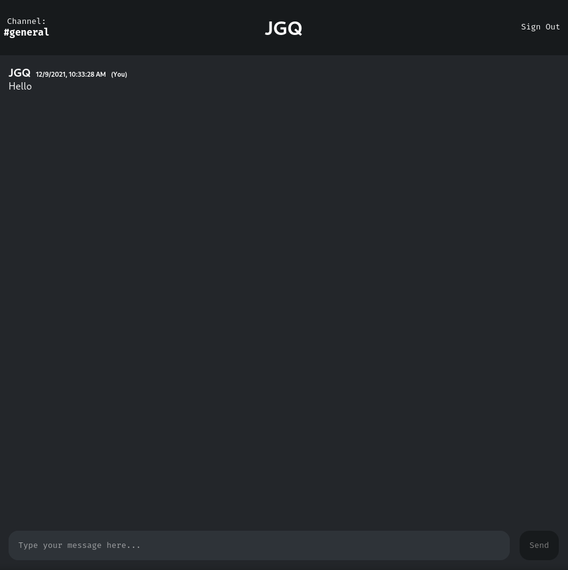

# Chat App

Simple real-time chat

## Table of contents
- [Introduction](#introduction)
- [Technologies](#technologies)
- [Illustrations](#illustrations)
- [To-Do](#to-do)

## Introduction
This project is a project from [app-ideas](https://github.com/rickywid/app-ideas).

It aims to create a chat app where users can interact with each other in realtime by sending messages. In this case, all the information is managed by the users (And a relay server) via Descentralized Graph DB managed using GUN.

For more information, here is a [short video](https://www.youtube.com/watch?v=oTQXzhm8w_8) and here's the official [documentation](https://gun.eco/docs).

## Technologies\*
- React v17.0.0
- SASS v1.44.0
- TypeScript v4.3.2
- GUN v0.2020.1235
- GUN-UTIL v0.0.17
##### \*Data can be found in **package.json** file

## Illustrations

  

## To-Do